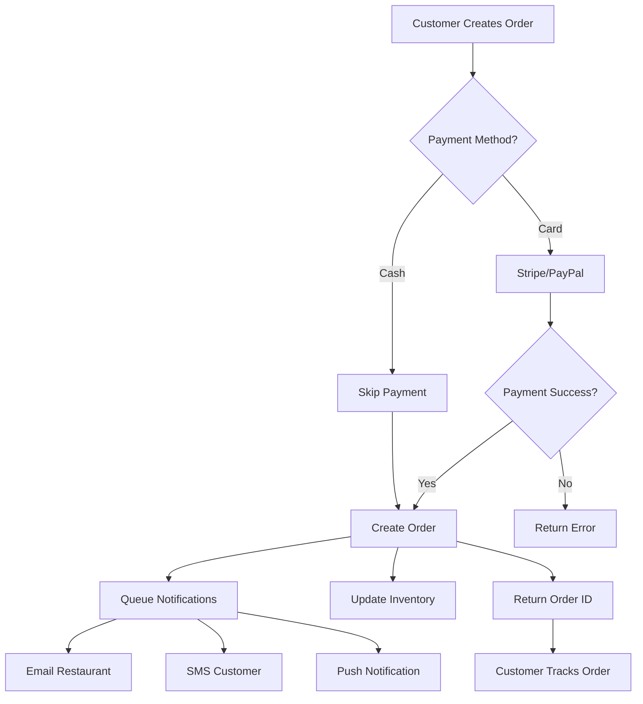
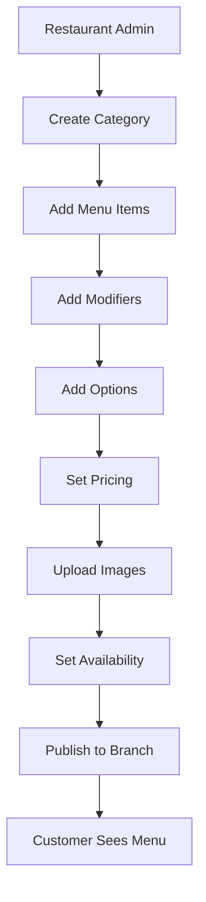

# 🏗️ System Architecture Overview

## **Restaurant Online Ordering SaaS Platform**

---

## **1. Executive Summary**

This document outlines the complete architecture for a multi-tenant SaaS platform enabling restaurants to manage online ordering, menus, deliveries, and customer interactions.

### **Key Features**
- ✅ Multi-tenant SaaS architecture
- ✅ Restaurant & branch management
- ✅ Dynamic menu builder with modifiers/variants
- ✅ Real-time order tracking
- ✅ Multiple payment gateways (Stripe, PayPal, Cash)
- ✅ Delivery radius & zone management
- ✅ Coupons & promotional offers
- ✅ QR code menu generation
- ✅ Multi-language (English + Arabic)
- ✅ Multi-currency support
- ✅ Role-based access control (RBAC)
- ✅ Super Admin dashboard for SaaS management
- ✅ Mobile-responsive customer interface

---

## **2. Technology Stack Recommendation**

### **2.1 Architecture Pattern: Modular Monolith**

**Decision: Modular Monolith (Not Microservices)**

**Rationale:**
- ✅ Faster initial development
- ✅ Easier debugging and testing
- ✅ Lower operational complexity
- ✅ Cost-effective for MVP and early scale
- ✅ Single deployment unit
- ✅ Can evolve to microservices later if needed

**Why NOT Microservices Initially:**
- ❌ Higher operational overhead (orchestration, service discovery)
- ❌ Increased development time
- ❌ Complex distributed transactions
- ❌ Overkill for initial scale (< 10k restaurants)

---

### **2.2 Technology Stack**

#### **Backend**
| Component | Technology | Rationale |
|-----------|-----------|-----------|
| **Language** | PHP 8.2+ | Native, fast, mature ecosystem |
| **Framework** | Custom MVC | Lightweight, full control, no bloat |
| **Database** | MySQL 8.0+ | ACID compliance, proven for multi-tenant |
| **Cache** | Redis 7.0+ | Session storage, rate limiting, caching |
| **Queue** | Redis + PHP Workers | Background jobs, async processing |
| **Search** | MySQL Full-Text (v1) → ElasticSearch (v2) | Menu search, progressive enhancement |
| **File Storage** | Local (v1) → S3/MinIO (v2) | Menu images, restaurant logos |
| **Authentication** | JWT + Refresh Tokens | Stateless, scalable, mobile-friendly |

#### **Frontend**
| Component | Technology | Rationale |
|-----------|-----------|-----------|
| **Customer App** | HTML5 + Bootstrap 5 + Vanilla JS | Fast, lightweight, SEO-friendly |
| **Admin Panel** | HTML5 + Bootstrap 5 + jQuery/Alpine.js | Rich interactions, rapid development |
| **UI Framework** | Bootstrap 5 | Responsive, mobile-first, well-documented |
| **Icons** | Font Awesome 6 | Comprehensive, free tier sufficient |
| **Charts** | Chart.js | Lightweight, dashboard analytics |

#### **DevOps & Infrastructure**
| Component | Technology | Rationale |
|-----------|-----------|-----------|
| **Web Server** | Nginx | High performance, reverse proxy |
| **PHP Runtime** | PHP-FPM | Process management, performance |
| **Containerization** | Docker + Docker Compose | Dev-prod parity, easy deployment |
| **CI/CD** | GitHub Actions | Free, integrated, YAML-based |
| **SSL** | Let's Encrypt (Certbot) | Free, automated renewal |
| **Monitoring** | Prometheus + Grafana (optional) | Metrics, alerting |

#### **Third-Party Integrations**
| Service | Purpose | Priority |
|---------|---------|----------|
| **Stripe** | Payment gateway | High |
| **PayPal** | Payment gateway | High |
| **Twilio** | SMS notifications | Medium |
| **SendGrid** | Transactional emails | High |
| **Google Maps API** | Delivery zones, geocoding | High |
| **Firebase** | Push notifications (mobile) | Medium |

---

## **3. Multi-Tenant Architecture**

### **3.1 Tenancy Model: Single Database with Tenant Isolation**

**Strategy:** Single shared database with `tenant_id` (restaurant_id) column in all tables.

**Advantages:**
- ✅ Simple to implement and maintain
- ✅ Cost-effective (single DB instance)
- ✅ Easy cross-tenant analytics
- ✅ Efficient resource utilization
- ✅ Easier backups and migrations

**Implementation:**
```php
// Every query automatically scoped to tenant
SELECT * FROM orders WHERE tenant_id = :restaurant_id AND status = 'pending';

// Middleware ensures tenant_id is injected
class TenantMiddleware {
    public function handle() {
        $tenantId = Auth::user()->restaurant_id;
        Tenant::setCurrentTenant($tenantId);
    }
}
```

**Security:**
- All queries enforced through middleware
- Database views for additional security
- Row-level security (RLS) if using PostgreSQL (future)
- Audit logs per tenant

---

## **4. System Layers & Components**

### **4.1 High-Level Architecture**

```
┌─────────────────────────────────────────────────────────────────┐
│                         CLIENTS                                  │
├──────────────────┬──────────────────┬──────────────────────────┤
│  Customer Web    │  Restaurant      │  Super Admin             │
│  (Bootstrap)     │  Admin Panel     │  Panel                   │
│                  │  (Bootstrap)     │  (Bootstrap)             │
└────────┬─────────┴────────┬─────────┴────────┬─────────────────┘
         │                  │                  │
         │                  │                  │
         └──────────────────┴──────────────────┘
                            │
                            │ HTTPS/REST API
                            │
         ┌──────────────────▼──────────────────────┐
         │        Nginx (Reverse Proxy)            │
         │         + SSL Termination                │
         └──────────────────┬──────────────────────┘
                            │
         ┌──────────────────▼──────────────────────┐
         │          PHP-FPM Application            │
         ├─────────────────────────────────────────┤
         │  ┌───────────────────────────────────┐  │
         │  │      Authentication Layer         │  │
         │  │   (JWT + Refresh Token + RBAC)    │  │
         │  └───────────────┬───────────────────┘  │
         │                  │                       │
         │  ┌───────────────▼───────────────────┐  │
         │  │      Middleware Pipeline          │  │
         │  │  • CORS                           │  │
         │  │  • Rate Limiting                  │  │
         │  │  • Tenant Isolation               │  │
         │  │  • Request Validation             │  │
         │  │  • Logging                        │  │
         │  └───────────────┬───────────────────┘  │
         │                  │                       │
         │  ┌───────────────▼───────────────────┐  │
         │  │      Application Core             │  │
         │  │  ┌────────────────────────────┐   │  │
         │  │  │ Auth Module                │   │  │
         │  │  ├────────────────────────────┤   │  │
         │  │  │ Restaurant Module          │   │  │
         │  │  ├────────────────────────────┤   │  │
         │  │  │ Menu Module                │   │  │
         │  │  ├────────────────────────────┤   │  │
         │  │  │ Order Module               │   │  │
         │  │  ├────────────────────────────┤   │  │
         │  │  │ Payment Module             │   │  │
         │  │  ├────────────────────────────┤   │  │
         │  │  │ Coupon Module              │   │  │
         │  │  ├────────────────────────────┤   │  │
         │  │  │ Customer Module            │   │  │
         │  │  ├────────────────────────────┤   │  │
         │  │  │ Notification Module        │   │  │
         │  │  ├────────────────────────────┤   │  │
         │  │  │ Super Admin Module         │   │  │
         │  │  └────────────────────────────┘   │  │
         │  └───────────────────────────────────┘  │
         └─────────────────┬───────────────────────┘
                           │
         ┌─────────────────┼───────────────────────┐
         │                 │                       │
         │                 │                       │
    ┌────▼────┐      ┌────▼────┐           ┌─────▼─────┐
    │  MySQL  │      │  Redis  │           │  S3/MinIO │
    │  8.0+   │      │  Cache  │           │   Files   │
    │         │      │  Queue  │           │           │
    └─────────┘      └─────────┘           └───────────┘
```

---

### **4.2 Request Flow**

```
Customer Orders Food
        │
        ▼
┌───────────────────┐
│ 1. Customer App   │
│    Sends POST     │
│    /api/orders    │
└────────┬──────────┘
         │
         ▼
┌───────────────────────┐
│ 2. Nginx              │
│    SSL Termination    │
│    Rate Limiting      │
└────────┬──────────────┘
         │
         ▼
┌───────────────────────┐
│ 3. PHP Middleware     │
│    • Auth (JWT)       │
│    • Tenant Scope     │
│    • Validation       │
└────────┬──────────────┘
         │
         ▼
┌───────────────────────┐
│ 4. Order Controller   │
│    • Validate cart    │
│    • Check inventory  │
│    • Apply coupon     │
│    • Calculate total  │
└────────┬──────────────┘
         │
         ▼
┌───────────────────────┐
│ 5. Payment Service    │
│    • Stripe/PayPal    │
│    • Process payment  │
└────────┬──────────────┘
         │
         ▼
┌───────────────────────┐
│ 6. Order Service      │
│    • Create order     │
│    • Update inventory │
│    • Queue jobs       │
└────────┬──────────────┘
         │
         ├──────────────────────┐
         │                      │
         ▼                      ▼
┌─────────────────┐    ┌─────────────────┐
│ 7. Database     │    │ 8. Redis Queue  │
│    Save order   │    │    • Email      │
│                 │    │    • SMS        │
└─────────────────┘    │    • Push       │
                       │    • Webhook    │
                       └─────────────────┘
```

---

## **5. Module Breakdown**

### **5.1 Core Modules**

| Module | Responsibilities | Key Entities |
|--------|------------------|--------------|
| **Auth** | Authentication, authorization, RBAC, JWT | Users, Roles, Permissions, Tokens |
| **Restaurant** | Restaurant management, branches, settings | Restaurants, Branches, OpeningHours |
| **Menu** | Categories, items, modifiers, variants | Categories, Items, Modifiers, Options |
| **Order** | Order lifecycle, tracking, kitchen display | Orders, OrderItems, OrderStatus |
| **Payment** | Payment processing, refunds, webhooks | Payments, Transactions, PaymentMethods |
| **Coupon** | Discount management, usage tracking | Coupons, CouponUsage |
| **Customer** | Customer profiles, addresses, favorites | Customers, Addresses, Favorites |
| **Delivery** | Zones, radius, driver assignment (future) | DeliveryZones, Drivers, Assignments |
| **Notification** | Email, SMS, push notifications | Notifications, Templates, Logs |
| **SuperAdmin** | Tenant management, billing, analytics | Tenants, Subscriptions, Plans |

---

## **6. Data Flow Patterns**

### **6.1 Order Processing Flow**



### **6.2 Menu Management Flow**



---

## **7. Security Architecture**

### **7.1 Security Layers**

```
┌─────────────────────────────────────────────┐
│  1. Network Security                        │
│     • Cloudflare (DDoS protection)          │
│     • Firewall rules                        │
│     • SSL/TLS encryption                    │
└─────────────────┬───────────────────────────┘
                  │
┌─────────────────▼───────────────────────────┐
│  2. Application Security                    │
│     • JWT authentication                    │
│     • RBAC authorization                    │
│     • Input validation (all inputs)         │
│     • SQL injection prevention (PDO)        │
│     • XSS protection (output escaping)      │
│     • CSRF tokens (forms)                   │
│     • Rate limiting (Redis)                 │
└─────────────────┬───────────────────────────┘
                  │
┌─────────────────▼───────────────────────────┐
│  3. Data Security                           │
│     • Tenant isolation (middleware)         │
│     • Password hashing (bcrypt)             │
│     • Sensitive data encryption             │
│     • Audit logs (all mutations)            │
│     • Soft deletes (data retention)         │
└─────────────────┬───────────────────────────┘
                  │
┌─────────────────▼───────────────────────────┐
│  4. Infrastructure Security                 │
│     • Environment variables (secrets)       │
│     • Database backups (daily)              │
│     • Read replicas (reporting)             │
│     • Monitoring & alerting                 │
└─────────────────────────────────────────────┘
```

### **7.2 Authentication Flow**

```
┌─────────────┐
│   Client    │
└──────┬──────┘
       │ 1. POST /api/auth/login
       │    {email, password}
       ▼
┌─────────────┐
│   Server    │
└──────┬──────┘
       │ 2. Validate credentials
       │ 3. Generate JWT (15min)
       │ 4. Generate Refresh Token (7 days)
       │ 5. Store refresh token (Redis/DB)
       ▼
┌─────────────┐
│   Client    │ Stores tokens
└──────┬──────┘
       │ 6. Subsequent requests
       │    Authorization: Bearer <JWT>
       ▼
┌─────────────┐
│   Server    │ Validates JWT
└──────┬──────┘
       │ 7. JWT expired?
       ▼
┌─────────────┐
│   Client    │ POST /api/auth/refresh
└──────┬──────┘    {refresh_token}
       │
       ▼
┌─────────────┐
│   Server    │ Issues new JWT
└─────────────┘
```

---

## **8. Scalability Strategy**

### **8.1 Horizontal Scaling Path**

**Phase 1: Single Server (0-100 restaurants)**
- Single VPS (4 vCPU, 8GB RAM)
- MySQL + Redis on same server
- Handles ~10k orders/day

**Phase 2: Load Balanced (100-1k restaurants)**
- 2-3 PHP-FPM servers (behind load balancer)
- Dedicated MySQL server (master-slave replication)
- Dedicated Redis server
- Handles ~100k orders/day

**Phase 3: Database Sharding (1k-10k restaurants)**
- 3+ PHP-FPM servers
- MySQL sharding by tenant_id (e.g., tenant_id % 4)
- Redis cluster
- CDN for static assets
- Handles ~1M orders/day

**Phase 4: Microservices (10k+ restaurants)**
- Split into microservices (Order, Menu, Payment, Notification)
- Kubernetes orchestration
- Event-driven architecture (RabbitMQ/Kafka)
- Elasticsearch for search
- Handles ~10M+ orders/day

### **8.2 Caching Strategy**

```php
// 1. Database Query Cache (Redis)
$menu = Cache::remember("menu:restaurant:{$id}", 3600, function() {
    return DB::query("SELECT * FROM menu_items WHERE restaurant_id = ?", [$id]);
});

// 2. HTTP Response Cache (Nginx)
# nginx.conf
location ~* \.(jpg|jpeg|png|gif|ico|css|js)$ {
    expires 1y;
    add_header Cache-Control "public, immutable";
}

// 3. Application Cache (Redis)
$settings = Redis::get("settings:restaurant:{$id}");
if (!$settings) {
    $settings = Restaurant::find($id)->settings;
    Redis::setex("settings:restaurant:{$id}", 3600, $settings);
}
```

---

## **9. High Availability & Disaster Recovery**

### **9.1 Backup Strategy**

| Component | Frequency | Retention | Method |
|-----------|-----------|-----------|--------|
| **Database** | Every 6 hours | 30 days | Automated mysqldump to S3 |
| **Files** | Daily | 90 days | Rsync to S3 |
| **Config** | On change | Forever | Git repository |
| **Redis** | Daily | 7 days | RDB snapshots |

### **9.2 Monitoring & Alerts**

```yaml
# Monitoring Stack
- Application Logs: PHP error logs → Centralized logging
- Performance Metrics: New Relic / DataDog (optional)
- Uptime Monitoring: Pingdom / UptimeRobot
- Error Tracking: Sentry (optional)

# Alert Triggers
- CPU > 80% for 5 minutes
- Memory > 90% for 5 minutes
- Disk space > 85%
- 5xx errors > 10 in 1 minute
- Order processing time > 5 seconds
- Payment failures > 5%
```

---

## **10. Development Workflow**

### **10.1 Environment Setup**

```bash
# 1. Clone repository
git clone https://github.com/restaurant/online-order.git
cd online-order

# 2. Start Docker environment
docker-compose up -d

# 3. Install dependencies
docker-compose exec php composer install

# 4. Run migrations
docker-compose exec php php cli.php migrate:run

# 5. Seed database
docker-compose exec php php cli.php db:seed

# 6. Access application
# Customer: http://localhost:8080
# Admin: http://localhost:8080/admin
# Super Admin: http://localhost:8080/superadmin
```

### **10.2 Git Workflow**

```
main (production)
  │
  ├── develop (staging)
  │     │
  │     ├── feature/menu-builder
  │     ├── feature/order-tracking
  │     ├── bugfix/payment-webhook
  │     └── hotfix/security-patch
```

---

## **11. Cost Estimation (Monthly)**

### **11.1 Infrastructure Costs**

| Service | Tier | Cost |
|---------|------|------|
| **VPS (DigitalOcean/Linode)** | 4 vCPU, 8GB RAM | $48 |
| **Database Backups (S3)** | 100GB | $2.30 |
| **CDN (Cloudflare)** | Free tier | $0 |
| **SSL (Let's Encrypt)** | Free | $0 |
| **Email (SendGrid)** | 40k emails/month | $15 |
| **SMS (Twilio)** | 1k SMS/month | $7 |
| **Stripe** | 2.9% + $0.30 per transaction | Variable |
| **Domain** | .com | $12/year |
| **Total (excluding payment fees)** | | **~$80/month** |

### **11.2 Scaling Costs**

- **100 restaurants:** ~$150/month
- **500 restaurants:** ~$500/month
- **1000 restaurants:** ~$1200/month

---

## **12. API Design Principles**

### **12.1 RESTful Standards**

```http
GET    /api/v1/restaurants          # List all (with pagination)
GET    /api/v1/restaurants/{id}     # Get single
POST   /api/v1/restaurants          # Create
PUT    /api/v1/restaurants/{id}     # Update (full)
PATCH  /api/v1/restaurants/{id}     # Update (partial)
DELETE /api/v1/restaurants/{id}     # Delete (soft)
```

### **12.2 Response Format**

```json
{
  "success": true,
  "message": "Order created successfully",
  "data": {
    "id": 12345,
    "order_number": "ORD-2025-00001",
    "status": "pending",
    "total": 45.99,
    "currency": "USD"
  },
  "meta": {
    "timestamp": "2025-11-19T10:30:00Z",
    "version": "1.0"
  }
}
```

---

## **13. Next Steps**

1. ✅ **Architecture Review** (this document)
2. ⏭️ **Database Schema Design** (ERD + SQL)
3. ⏭️ **API Documentation** (OpenAPI spec)
4. ⏭️ **Backend Implementation**
5. ⏭️ **Frontend Implementation**
6. ⏭️ **DevOps Setup** (Docker, CI/CD)
7. ⏭️ **Testing & QA**
8. ⏭️ **Deployment**

---

## **14. Key Decisions Summary**

| Decision | Choice | Rationale |
|----------|--------|-----------|
| Architecture | Modular Monolith | Faster development, lower complexity |
| Database | MySQL 8.0+ | ACID, proven, mature |
| Multi-Tenancy | Single DB + tenant_id | Cost-effective, simple |
| Auth | JWT + Refresh Tokens | Stateless, scalable |
| Frontend | Bootstrap 5 + Vanilla JS | Fast, SEO-friendly |
| Deployment | Docker + Docker Compose | Dev-prod parity |
| CI/CD | GitHub Actions | Free, integrated |

---

**Document Version:** 1.0
**Last Updated:** 2025-11-19
**Author:** Senior Full-Stack Engineering Team

