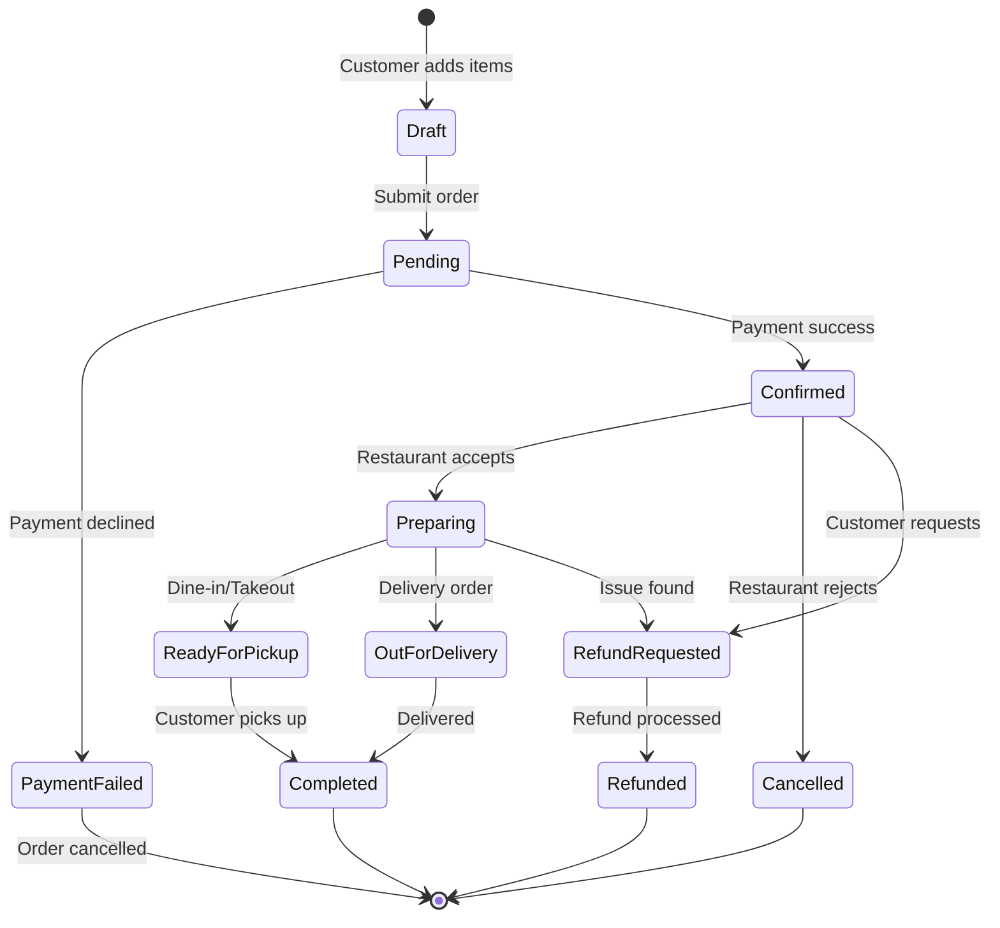

# 📊 System Diagrams & Visual Architecture

## **Restaurant Online Ordering SaaS Platform**

---

## **1. High-Level System Architecture**

```
┌────────────────────────────────────────────────────────────────────────────┐
│                              PRESENTATION LAYER                             │
├────────────────┬──────────────────┬──────────────────┬────────────────────┤
│                │                  │                  │                    │
│   Customer     │   Restaurant     │   Super Admin    │   Mobile App       │
│   Web App      │   Admin Panel    │   Dashboard      │   (React Native)   │
│                │                  │                  │   [Future]         │
│  [Bootstrap 5] │  [Bootstrap 5]   │  [Bootstrap 5]   │                    │
│  [Vanilla JS]  │  [jQuery/Alpine] │  [Chart.js]      │                    │
│                │                  │                  │                    │
└────────┬───────┴────────┬─────────┴────────┬─────────┴────────┬───────────┘
         │                │                  │                  │
         └────────────────┴──────────────────┴──────────────────┘
                          │
                          │ HTTPS / REST API / JSON
                          │
         ┌────────────────▼────────────────────────────────┐
         │          CLOUDFLARE (OPTIONAL)                  │
         │  • DDoS Protection                              │
         │  • CDN for static assets                        │
         │  • Web Application Firewall (WAF)               │
         └────────────────┬────────────────────────────────┘
                          │
         ┌────────────────▼────────────────────────────────┐
         │            NGINX REVERSE PROXY                  │
         │  • SSL Termination (Let's Encrypt)              │
         │  • Load Balancing (when scaled)                 │
         │  • Rate Limiting                                │
         │  • Static file serving                          │
         │  • Gzip compression                             │
         └────────────────┬────────────────────────────────┘
                          │
┌─────────────────────────▼─────────────────────────────────────┐
│                  APPLICATION LAYER (PHP 8.2+)                 │
├───────────────────────────────────────────────────────────────┤
│                                                               │
│  ┌──────────────────────────────────────────────────────┐   │
│  │         SECURITY MIDDLEWARE PIPELINE                 │   │
│  │  ┌────────────────────────────────────────────────┐  │   │
│  │  │ 1. CORS Handler                                │  │   │
│  │  ├────────────────────────────────────────────────┤  │   │
│  │  │ 2. Rate Limiter (Redis)                        │  │   │
│  │  ├────────────────────────────────────────────────┤  │   │
│  │  │ 3. JWT Authentication                          │  │   │
│  │  ├────────────────────────────────────────────────┤  │   │
│  │  │ 4. Tenant Isolation (Multi-tenancy)            │  │   │
│  │  ├────────────────────────────────────────────────┤  │   │
│  │  │ 5. RBAC Authorization                          │  │   │
│  │  ├────────────────────────────────────────────────┤  │   │
│  │  │ 6. Request Validation                          │  │   │
│  │  ├────────────────────────────────────────────────┤  │   │
│  │  │ 7. Audit Logging                               │  │   │
│  │  └────────────────────────────────────────────────┘  │   │
│  └──────────────────────────────────────────────────────┘   │
│                                                               │
│  ┌──────────────────────────────────────────────────────┐   │
│  │              MVC ROUTER                              │   │
│  │  /api/v1/* → Controllers → Services → Models        │   │
│  └──────────────────┬───────────────────────────────────┘   │
│                     │                                        │
│  ┌──────────────────▼───────────────────────────────────┐   │
│  │           APPLICATION MODULES                        │   │
│  │                                                       │   │
│  │  ┌─────────────┐  ┌─────────────┐  ┌──────────────┐ │   │
│  │  │ Auth Module │  │ Restaurant  │  │ Menu Module  │ │   │
│  │  │             │  │ Module      │  │              │ │   │
│  │  │ • Login     │  │ • CRUD      │  │ • Categories │ │   │
│  │  │ • Register  │  │ • Branches  │  │ • Items      │ │   │
│  │  │ • JWT       │  │ • Staff     │  │ • Modifiers  │ │   │
│  │  │ • Refresh   │  │ • Settings  │  │ • Variants   │ │   │
│  │  └─────────────┘  └─────────────┘  └──────────────┘ │   │
│  │                                                       │   │
│  │  ┌─────────────┐  ┌─────────────┐  ┌──────────────┐ │   │
│  │  │ Order       │  │ Payment     │  │ Coupon       │ │   │
│  │  │ Module      │  │ Module      │  │ Module       │ │   │
│  │  │             │  │             │  │              │ │   │
│  │  │ • Create    │  │ • Stripe    │  │ • Discounts  │ │   │
│  │  │ • Track     │  │ • PayPal    │  │ • Validation │ │   │
│  │  │ • Update    │  │ • Cash      │  │ • Usage      │ │   │
│  │  │ • Cancel    │  │ • Webhooks  │  │ • Limits     │ │   │
│  │  └─────────────┘  └─────────────┘  └──────────────┘ │   │
│  │                                                       │   │
│  │  ┌─────────────┐  ┌─────────────┐  ┌──────────────┐ │   │
│  │  │ Customer    │  │ Notification│  │ Super Admin  │ │   │
│  │  │ Module      │  │ Module      │  │ Module       │ │   │
│  │  │             │  │             │  │              │ │   │
│  │  │ • Profile   │  │ • Email     │  │ • Tenants    │ │   │
│  │  │ • Addresses │  │ • SMS       │  │ • Billing    │ │   │
│  │  │ • History   │  │ • Push      │  │ • Analytics  │ │   │
│  │  │ • Favorites │  │ • Templates │  │ • Reports    │ │   │
│  │  └─────────────┘  └─────────────┘  └──────────────┘ │   │
│  └───────────────────────────────────────────────────────┘   │
│                                                               │
└───────────────────┬───────────────────────┬───────────────────┘
                    │                       │
                    │                       │
    ┌───────────────▼──────────┐  ┌─────────▼────────────┐
    │      DATA LAYER          │  │   BACKGROUND JOBS    │
    │                          │  │                      │
    │  ┌────────────────────┐  │  │  ┌────────────────┐ │
    │  │ MySQL 8.0+         │  │  │  │ Redis Queue    │ │
    │  │                    │  │  │  │                │ │
    │  │ • Multi-tenant DB  │  │  │  │ • Email jobs   │ │
    │  │ • Indexed queries  │  │  │  │ • SMS jobs     │ │
    │  │ • Foreign keys     │  │  │  │ • Push jobs    │ │
    │  │ • Transactions     │  │  │  │ • Webhooks     │ │
    │  │ • Daily backups    │  │  │  │ • Cron tasks   │ │
    │  └────────────────────┘  │  │  └────────────────┘ │
    │                          │  │                      │
    │  ┌────────────────────┐  │  │  ┌────────────────┐ │
    │  │ Redis 7.0+         │  │  │  │ PHP Workers    │ │
    │  │                    │  │  │  │                │ │
    │  │ • Session cache    │  │  │  │ • Worker pool  │ │
    │  │ • Query cache      │  │  │  │ • Job process  │ │
    │  │ • Rate limiting    │  │  │  │ • Error retry  │ │
    │  │ • Job queue        │  │  │  └────────────────┘ │
    │  └────────────────────┘  │  └──────────────────────┘
    │                          │
    │  ┌────────────────────┐  │
    │  │ S3 / MinIO         │  │
    │  │                    │  │
    │  │ • Menu images      │  │
    │  │ • Restaurant logos │  │
    │  │ • QR codes         │  │
    │  │ • Backups          │  │
    │  └────────────────────┘  │
    └──────────────────────────┘
                    │
    ┌───────────────▼──────────────────────────────┐
    │        EXTERNAL SERVICES (APIs)              │
    ├──────────────────────────────────────────────┤
    │  • Stripe (Payments)                         │
    │  • PayPal (Payments)                         │
    │  • Twilio (SMS)                              │
    │  • SendGrid (Email)                          │
    │  • Google Maps (Geocoding & delivery zones)  │
    │  • Firebase (Push notifications - optional)  │
    └──────────────────────────────────────────────┘
```

---

## **2. Database Architecture (Multi-Tenant)**

```
┌────────────────────────────────────────────────────────────┐
│           MySQL 8.0+ (Single Shared Database)              │
├────────────────────────────────────────────────────────────┤
│                                                            │
│  ┌──────────────────────────────────────────────────────┐ │
│  │           TENANT ISOLATION STRATEGY                  │ │
│  │                                                      │ │
│  │  Every table includes: tenant_id (restaurant_id)    │ │
│  │                                                      │ │
│  │  CREATE TABLE orders (                              │ │
│  │    id BIGINT PRIMARY KEY,                           │ │
│  │    tenant_id BIGINT NOT NULL,    ← Tenant Isolation│ │
│  │    customer_id BIGINT,                              │ │
│  │    total DECIMAL(10,2),                             │ │
│  │    ...                                              │ │
│  │    INDEX idx_tenant_id (tenant_id)                  │ │
│  │  );                                                 │ │
│  │                                                      │ │
│  │  All queries: WHERE tenant_id = :current_tenant     │ │
│  └──────────────────────────────────────────────────────┘ │
│                                                            │
│  ┌──────────────────────────────────────────────────────┐ │
│  │                  TABLE GROUPS                        │ │
│  ├──────────────────────────────────────────────────────┤ │
│  │                                                      │ │
│  │  [AUTH & USERS]                                      │ │
│  │    • users                                           │ │
│  │    • roles                                           │ │
│  │    • permissions                                     │ │
│  │    • role_user                                       │ │
│  │    • refresh_tokens                                  │ │
│  │                                                      │ │
│  │  [RESTAURANTS]                                       │ │
│  │    • restaurants (tenants)                           │ │
│  │    • branches                                        │ │
│  │    • opening_hours                                   │ │
│  │    • delivery_zones                                  │ │
│  │    • restaurant_settings                             │ │
│  │                                                      │ │
│  │  [MENU SYSTEM]                                       │ │
│  │    • categories                                      │ │
│  │    • menu_items                                      │ │
│  │    • item_modifiers                                  │ │
│  │    • modifier_options                                │ │
│  │    • item_variants                                   │ │
│  │    • item_availability (per branch)                  │ │
│  │                                                      │ │
│  │  [ORDERS]                                            │ │
│  │    • orders                                          │ │
│  │    • order_items                                     │ │
│  │    • order_status_history                            │ │
│  │    • order_notes                                     │ │
│  │                                                      │ │
│  │  [CUSTOMERS]                                         │ │
│  │    • customers                                       │ │
│  │    • customer_addresses                              │ │
│  │    • customer_favorites                              │ │
│  │                                                      │ │
│  │  [PAYMENTS]                                          │ │
│  │    • payments                                        │ │
│  │    • payment_methods                                 │ │
│  │    • transactions                                    │ │
│  │    • refunds                                         │ │
│  │                                                      │ │
│  │  [COUPONS]                                           │ │
│  │    • coupons                                         │ │
│  │    • coupon_usage                                    │ │
│  │                                                      │ │
│  │  [NOTIFICATIONS]                                     │ │
│  │    • notifications                                   │ │
│  │    • notification_templates                          │ │
│  │    • notification_logs                               │ │
│  │                                                      │ │
│  │  [SUPER ADMIN]                                       │ │
│  │    • subscriptions                                   │ │
│  │    • subscription_plans                              │ │
│  │    • invoices                                        │ │
│  │    • support_tickets                                 │ │
│  │                                                      │ │
│  │  [AUDIT]                                             │ │
│  │    • audit_logs                                      │ │
│  │    • activity_logs                                   │ │
│  └──────────────────────────────────────────────────────┘ │
└────────────────────────────────────────────────────────────┘

┌────────────────────────────────────────────────────────────┐
│                    Redis 7.0+ (Cache & Queue)              │
├────────────────────────────────────────────────────────────┤
│  Database 0: Session Storage                               │
│    • session:{user_id} → session data                      │
│    • refresh_token:{token} → user data                     │
│                                                            │
│  Database 1: Application Cache                             │
│    • menu:restaurant:{id} → menu JSON                      │
│    • settings:restaurant:{id} → settings JSON              │
│    • categories:restaurant:{id} → categories JSON          │
│                                                            │
│  Database 2: Rate Limiting                                 │
│    • ratelimit:ip:{ip} → request count                     │
│    • ratelimit:user:{user_id} → request count              │
│                                                            │
│  Database 3: Job Queue                                     │
│    • queue:emails → list of email jobs                     │
│    • queue:sms → list of SMS jobs                          │
│    • queue:webhooks → list of webhook jobs                 │
└────────────────────────────────────────────────────────────┘
```

---

## **3. Order Lifecycle State Machine**



### **Order Status Flow Details**

| Status | Description | Actions Available | Notifications |
|--------|-------------|-------------------|---------------|
| **Draft** | Cart not submitted | Continue shopping, Clear cart | - |
| **Pending** | Awaiting payment | Process payment | - |
| **PaymentFailed** | Payment declined | Retry payment | Email customer |
| **Confirmed** | Payment successful | Accept/Reject order | SMS + Email (customer & restaurant) |
| **Preparing** | Being prepared | Update to next status | Push notification |
| **ReadyForPickup** | Ready (takeout) | Mark completed | SMS customer |
| **OutForDelivery** | Driver en route | Mark delivered | SMS + live tracking |
| **Completed** | Order fulfilled | Leave review | Email receipt |
| **Cancelled** | Order cancelled | Refund if paid | Email notification |
| **RefundRequested** | Refund initiated | Approve/reject refund | Email notification |
| **Refunded** | Money returned | Close ticket | Email confirmation |

---

## **4. Authentication & Authorization Flow**

```
┌──────────────────────────────────────────────────────────────┐
│                  AUTHENTICATION FLOW (JWT)                   │
└──────────────────────────────────────────────────────────────┘

Step 1: Login Request
───────────────────────
Client                          Server
  │                               │
  │  POST /api/v1/auth/login      │
  │  {                            │
  │    email: "admin@rest.com",   │
  │    password: "********"       │
  │  }                            │
  ├──────────────────────────────►│
  │                               │ 1. Validate credentials
  │                               │ 2. Hash & compare password
  │                               │ 3. Load user + roles
  │                               │ 4. Generate JWT (15 min)
  │                               │ 5. Generate refresh token (7 days)
  │                               │ 6. Store refresh token in Redis
  │                               │
  │  200 OK                       │
  │  {                            │
  │    access_token: "eyJhbG...", │
  │    refresh_token: "8f7e...",  │
  │    expires_in: 900,           │
  │    user: {...}                │
  │  }                            │
  │◄──────────────────────────────┤
  │                               │
  │ Store tokens (localStorage)   │
  │                               │


Step 2: Authenticated Request
──────────────────────────────
Client                          Server
  │                               │
  │  GET /api/v1/menu             │
  │  Authorization: Bearer eyJ... │
  ├──────────────────────────────►│
  │                               │ 1. Extract JWT from header
  │                               │ 2. Verify signature
  │                               │ 3. Check expiration
  │                               │ 4. Load tenant_id from JWT
  │                               │ 5. Set tenant scope
  │                               │ 6. Check RBAC permissions
  │                               │
  │  200 OK                       │
  │  { data: [...] }              │
  │◄──────────────────────────────┤


Step 3: Token Refresh
──────────────────────
Client                          Server
  │                               │
  │  POST /api/v1/auth/refresh    │
  │  {                            │
  │    refresh_token: "8f7e..."   │
  │  }                            │
  ├──────────────────────────────►│
  │                               │ 1. Validate refresh token
  │                               │ 2. Check Redis for validity
  │                               │ 3. Check not revoked
  │                               │ 4. Generate new JWT
  │                               │ 5. Optionally rotate refresh token
  │                               │
  │  200 OK                       │
  │  {                            │
  │    access_token: "eyJnZX...", │
  │    expires_in: 900            │
  │  }                            │
  │◄──────────────────────────────┤


JWT Payload Structure
─────────────────────
{
  "sub": 123,                      // User ID
  "tenant_id": 45,                 // Restaurant ID
  "email": "admin@restaurant.com",
  "roles": ["restaurant_admin"],
  "permissions": ["menu.write", "orders.read"],
  "iat": 1700000000,               // Issued at
  "exp": 1700000900                // Expires at (15 min)
}
```

---

## **5. Role-Based Access Control (RBAC)**

```
┌──────────────────────────────────────────────────────────────┐
│                       ROLE HIERARCHY                          │
└──────────────────────────────────────────────────────────────┘

                    ┌─────────────────┐
                    │  SUPER ADMIN    │
                    │  (Platform)     │
                    └────────┬────────┘
                             │ All permissions
                             │
            ┌────────────────┼────────────────┐
            │                │                │
    ┌───────▼───────┐ ┌──────▼──────┐ ┌──────▼──────┐
    │  RESTAURANT   │ │   TENANT    │ │   SUPPORT   │
    │     OWNER     │ │   MANAGER   │ │     TEAM    │
    └───────┬───────┘ └─────────────┘ └─────────────┘
            │ Tenant-scoped
            │
    ┌───────┼───────────────┐
    │       │               │
┌───▼───┐ ┌─▼────┐   ┌─────▼─────┐
│BRANCH │ │STAFF │   │  KITCHEN  │
│MANAGER│ │ADMIN │   │  DISPLAY  │
└───┬───┘ └──────┘   └───────────┘
    │
┌───▼────┐
│CASHIER │
└────────┘


Permission Matrix
─────────────────
╔═══════════════════╦═══════╦═════════╦═════════╦════════╦═════════╗
║ Resource          ║ Super ║ Rest.   ║ Branch  ║ Staff  ║ Cashier ║
║                   ║ Admin ║ Owner   ║ Manager ║ Admin  ║         ║
╠═══════════════════╬═══════╬═════════╬═════════╬════════╬═════════╣
║ All Tenants       ║  ✓    ║    ✗    ║    ✗    ║   ✗    ║    ✗    ║
║ Billing           ║  ✓    ║    ✓    ║    ✗    ║   ✗    ║    ✗    ║
║ Restaurant Setup  ║  ✓    ║    ✓    ║    ✗    ║   ✗    ║    ✗    ║
║ Menu Management   ║  ✓    ║    ✓    ║    ✓    ║   ✓    ║    ✗    ║
║ Orders (All)      ║  ✓    ║    ✓    ║    ✓    ║   ✓    ║    ✗    ║
║ Orders (Branch)   ║  ✓    ║    ✓    ║    ✓    ║   ✓    ║    ✓    ║
║ Staff Management  ║  ✓    ║    ✓    ║    ✓    ║   ✗    ║    ✗    ║
║ Reports           ║  ✓    ║    ✓    ║    ✓    ║   ✓    ║    ✗    ║
║ Coupons           ║  ✓    ║    ✓    ║    ✓    ║   ✗    ║    ✗    ║
║ Settings          ║  ✓    ║    ✓    ║    ✗    ║   ✗    ║    ✗    ║
╚═══════════════════╩═══════╩═════════╩═════════╩════════╩═════════╝
```

---

## **6. Payment Integration Flow**

```
┌──────────────────────────────────────────────────────────────┐
│                    PAYMENT PROCESSING FLOW                    │
└──────────────────────────────────────────────────────────────┘

Stripe/PayPal Flow
──────────────────

Customer                App Backend              Payment Gateway
   │                        │                           │
   │ 1. Checkout            │                           │
   ├───────────────────────►│                           │
   │                        │ 2. Create payment intent  │
   │                        ├──────────────────────────►│
   │                        │                           │
   │                        │ 3. Client secret          │
   │                        │◄──────────────────────────┤
   │ 4. Client secret       │                           │
   │◄───────────────────────┤                           │
   │                        │                           │
   │ 5. Enter card details  │                           │
   │ (handled by Stripe.js) │                           │
   ├────────────────────────┼──────────────────────────►│
   │                        │                           │ 6. Process
   │                        │                           │    payment
   │                        │                           │
   │ 7. Payment result      │                           │
   │◄───────────────────────┼───────────────────────────┤
   │                        │                           │
   │                        │ 8. Webhook (async)        │
   │                        │◄──────────────────────────┤
   │                        │                           │
   │                        │ 9. Update order status    │
   │                        │    (confirmed)            │
   │                        │                           │
   │ 10. Order confirmed    │                           │
   │◄───────────────────────┤                           │


Cash on Delivery Flow
─────────────────────

Customer                App Backend
   │                        │
   │ 1. Select COD          │
   ├───────────────────────►│
   │                        │ 2. Create order (COD)
   │                        │    status = confirmed
   │                        │    payment_status = pending
   │                        │
   │ 3. Order confirmed     │
   │◄───────────────────────┤
   │                        │
   │                        │ 4. On delivery
   │ 5. Pay driver          │    Driver marks paid
   ├───────────────────────►│
   │                        │ 5. Update payment_status
   │                        │    = completed


Webhook Handling (Stripe)
──────────────────────────

Stripe                  App Backend               Database
  │                         │                         │
  │ payment_intent.succeeded│                         │
  ├────────────────────────►│                         │
  │                         │ 1. Verify signature     │
  │                         │    (webhook secret)     │
  │                         │                         │
  │                         │ 2. Extract payment_id   │
  │                         │                         │
  │                         │ 3. Update payment       │
  │                         ├────────────────────────►│
  │                         │                         │
  │                         │ 4. Update order status  │
  │                         ├────────────────────────►│
  │                         │                         │
  │                         │ 5. Queue notifications  │
  │                         │    (email, SMS)         │
  │                         │                         │
  │ 200 OK (acknowledge)    │                         │
  │◄────────────────────────┤                         │
```

---

## **7. Menu System Architecture**

```
┌──────────────────────────────────────────────────────────────┐
│                    MENU HIERARCHY STRUCTURE                   │
└──────────────────────────────────────────────────────────────┘

Restaurant
    └── Branches (multiple locations)
         └── Categories (Burgers, Pizza, Drinks, etc.)
              └── Menu Items
                   ├── Base Item (Name, description, price)
                   ├── Images (multiple)
                   ├── Modifiers (What extras can be added?)
                   │    └── Options (Specific choices)
                   │         ├── Extra Cheese (+$2)
                   │         ├── Extra Sauce (+$1)
                   │         └── Extra Meat (+$3)
                   ├── Variants (Size, spice level, etc.)
                   │    ├── Small ($10)
                   │    ├── Medium ($15)
                   │    └── Large ($20)
                   └── Availability
                        ├── Branch-specific
                        ├── Time-based (lunch only, etc.)
                        └── Stock (in stock / out of stock)


Example: Pizza Menu Item
─────────────────────────

Menu Item: "Margherita Pizza"
├── Base Price: $12.99
├── Description: "Classic tomato sauce, mozzarella, basil"
├── Category: Pizzas
├── Images: [margherita1.jpg, margherita2.jpg]
│
├── Modifiers Group 1: "Size" (Required, Single choice)
│   ├── Small (9") → +$0
│   ├── Medium (12") → +$3
│   └── Large (16") → +$6
│
├── Modifiers Group 2: "Extra Toppings" (Optional, Multiple choice)
│   ├── Extra Cheese → +$2
│   ├── Mushrooms → +$1.5
│   ├── Olives → +$1.5
│   ├── Pepperoni → +$3
│   └── Chicken → +$3.5
│
├── Modifiers Group 3: "Crust Type" (Required, Single choice)
│   ├── Thin Crust → +$0
│   ├── Thick Crust → +$1
│   └── Stuffed Crust → +$3
│
└── Availability
    ├── Branch A: Available
    ├── Branch B: Out of stock
    └── Time: All day


Final Order Calculation
───────────────────────
Customer selects:
  - Margherita Pizza (base: $12.99)
  - Size: Large (+$6)
  - Extra Toppings: Extra Cheese (+$2), Pepperoni (+$3)
  - Crust: Stuffed Crust (+$3)

Total: $12.99 + $6 + $2 + $3 + $3 = $26.99
```

---

## **8. Deployment Architecture**

```
┌──────────────────────────────────────────────────────────────┐
│                    PRODUCTION DEPLOYMENT                      │
└──────────────────────────────────────────────────────────────┘

Phase 1: Single Server (MVP)
─────────────────────────────

                        ┌─────────────────┐
                        │   Cloudflare    │
                        │   (CDN + WAF)   │
                        └────────┬────────┘
                                 │
                        ┌────────▼────────┐
                        │  VPS/Droplet    │
                        │  4 vCPU, 8GB    │
                        ├─────────────────┤
                        │  Docker Host    │
                        │                 │
                        │  ┌───────────┐  │
                        │  │  Nginx    │  │
                        │  │  (80,443) │  │
                        │  └─────┬─────┘  │
                        │        │        │
                        │  ┌─────▼─────┐  │
                        │  │ PHP-FPM   │  │
                        │  │   (9000)  │  │
                        │  └───────────┘  │
                        │                 │
                        │  ┌───────────┐  │
                        │  │  MySQL    │  │
                        │  │  (3306)   │  │
                        │  └───────────┘  │
                        │                 │
                        │  ┌───────────┐  │
                        │  │   Redis   │  │
                        │  │  (6379)   │  │
                        │  └───────────┘  │
                        └─────────────────┘


Phase 2: Load Balanced (Scale)
───────────────────────────────

                    ┌─────────────────┐
                    │   Cloudflare    │
                    └────────┬────────┘
                             │
                    ┌────────▼────────┐
                    │ Load Balancer   │
                    │   (Nginx)       │
                    └───┬─────────┬───┘
                        │         │
            ┌───────────┘         └───────────┐
            │                                  │
    ┌───────▼────────┐              ┌─────────▼──────┐
    │  PHP Server 1  │              │  PHP Server 2  │
    │                │              │                │
    │  ┌──────────┐  │              │  ┌──────────┐  │
    │  │ PHP-FPM  │  │              │  │ PHP-FPM  │  │
    │  │  Nginx   │  │              │  │  Nginx   │  │
    │  └──────────┘  │              │  └──────────┘  │
    └────────┬───────┘              └────────┬───────┘
             │                                │
             └────────────┬───────────────────┘
                          │
            ┌─────────────▼─────────────┐
            │    Database Server        │
            │    (MySQL Master)         │
            │                           │
            │    ┌────────────────┐     │
            │    │  MySQL (RW)    │     │
            │    └───────┬────────┘     │
            │            │              │
            │    ┌───────▼────────┐     │
            │    │ MySQL (Replica)│     │
            │    │   (Read only)  │     │
            │    └────────────────┘     │
            └───────────────────────────┘
                          │
            ┌─────────────▼─────────────┐
            │      Cache Server         │
            │      (Redis)              │
            └───────────────────────────┘
```

---

## **9. CI/CD Pipeline**

```
┌──────────────────────────────────────────────────────────────┐
│                  GitHub Actions Workflow                      │
└──────────────────────────────────────────────────────────────┘

Trigger: Push to main branch

┌─────────────────┐
│  1. Checkout    │  Clone repository
└────────┬────────┘
         │
┌────────▼────────┐
│  2. Setup PHP   │  Install PHP 8.2
└────────┬────────┘
         │
┌────────▼────────┐
│  3. Dependencies│  composer install
└────────┬────────┘
         │
┌────────▼────────┐
│  4. Lint        │  PHP CodeSniffer
└────────┬────────┘
         │
┌────────▼────────┐
│  5. Unit Tests  │  PHPUnit
└────────┬────────┘
         │
┌────────▼────────┐
│  6. Build Image │  docker build
└────────┬────────┘
         │
┌────────▼────────┐
│  7. Push Image  │  docker push
└────────┬────────┘
         │
┌────────▼────────┐
│  8. Deploy      │  SSH to server
│                 │  docker-compose pull
│                 │  docker-compose up -d
└────────┬────────┘
         │
┌────────▼────────┐
│  9. Migrations  │  Run DB migrations
└────────┬────────┘
         │
┌────────▼────────┐
│ 10. Health Check│  curl /api/health
└────────┬────────┘
         │
┌────────▼────────┐
│ 11. Notify      │  Slack/Email
└─────────────────┘
```

---

## **10. Security Layers Diagram**

```
┌──────────────────────────────────────────────────────────────┐
│                      SECURITY ARCHITECTURE                    │
└──────────────────────────────────────────────────────────────┘

Layer 1: Network Security
─────────────────────────
    ┌────────────────────────────────────────┐
    │  Cloudflare WAF                        │
    │  • DDoS protection                     │
    │  • Bot detection                       │
    │  • IP blacklisting                     │
    └──────────────┬─────────────────────────┘
                   │
    ┌──────────────▼─────────────────────────┐
    │  Firewall (UFW)                        │
    │  • Allow: 80, 443                      │
    │  • Allow: 22 (SSH, key-only)           │
    │  • Deny: All other ports               │
    └──────────────┬─────────────────────────┘

Layer 2: Application Security
──────────────────────────────
    ┌──────────────▼─────────────────────────┐
    │  Nginx                                 │
    │  • Rate limiting (10 req/sec)          │
    │  • Request size limits                 │
    │  • Timeout protection                  │
    └──────────────┬─────────────────────────┘
                   │
    ┌──────────────▼─────────────────────────┐
    │  PHP Application                       │
    │  • Input validation (all inputs)       │
    │  • SQL injection prevention (PDO)      │
    │  • XSS protection (htmlspecialchars)   │
    │  • CSRF tokens (forms)                 │
    │  • JWT authentication                  │
    │  • RBAC authorization                  │
    └──────────────┬─────────────────────────┘

Layer 3: Data Security
──────────────────────
    ┌──────────────▼─────────────────────────┐
    │  Database                              │
    │  • Tenant isolation (tenant_id)        │
    │  • Password hashing (bcrypt)           │
    │  • Encrypted connections (SSL)         │
    │  • Prepared statements only            │
    │  • No root access from app             │
    └──────────────┬─────────────────────────┘

Layer 4: Audit & Monitoring
────────────────────────────
    ┌──────────────▼─────────────────────────┐
    │  Logging & Auditing                    │
    │  • All mutations logged                │
    │  • Failed login attempts               │
    │  • API access logs                     │
    │  • Error tracking (Sentry)             │
    └────────────────────────────────────────┘
```

---

**Document Version:** 1.0
**Last Updated:** 2025-11-19

